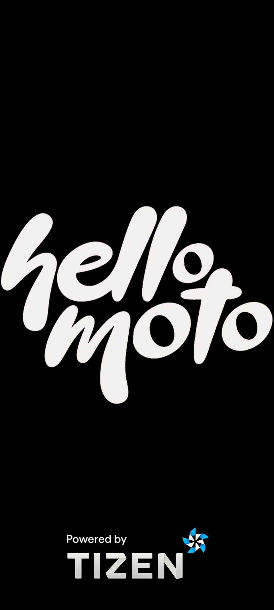
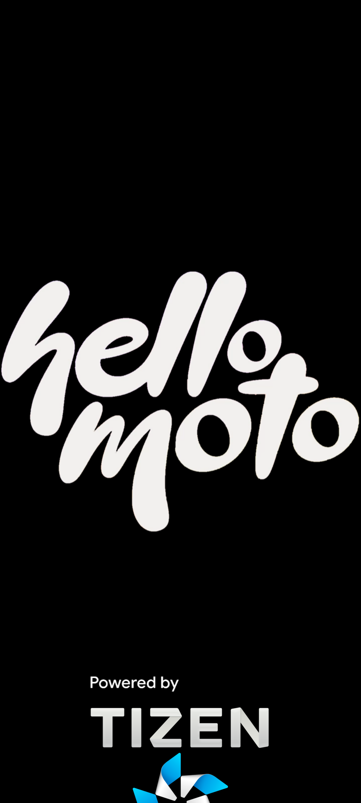
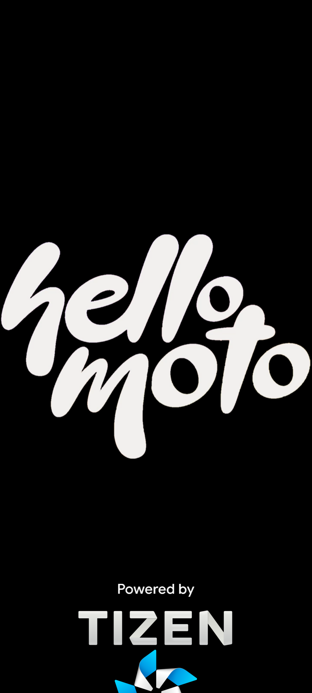

<h1 align="center">📱 Bootlogos custom for Family Moto Gx2 SM6225</h1>

<b>This is the most different repository I've ever made, inspired by the readme of DevHiOliveira from XOS, I don't have much to describe here, it's just a repository with the bootlogos that I do out of boredom, even this repository was made because I got very bored, anyway, let's go to the different previews 

  
  
  

  
  
  

  
  
  

<h1 align="center">📲 Tutorial to flash bootlogo</h1>

1. Reboot to bootloader mode
2. enter command to flash bootlogo:
'''bash
fastboot flash logo <path/to/logo.bin>
'''
3. Reboot the phone and finish! Bootlogo flashed!!

